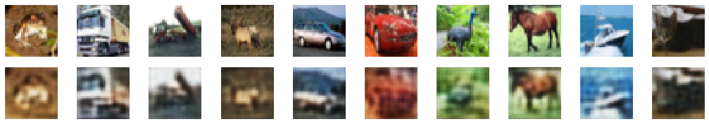
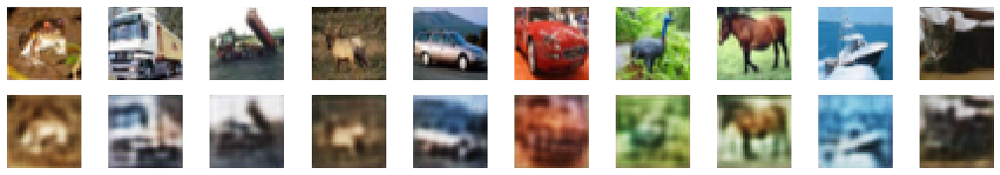

# Lossy image autoencoders

This implementation has been done for course completion of **AV494 - Deep Learning for Computational Data Sciences** at **Indian Institute
of Space Science and Technology**. Course instructor : **Dr. Deepak Mishra**.

Referrence from : https://www.bonaccorso.eu/2017/07/29/lossy-image-autoencoders-convolution-deconvolution-networks-tensorflow/ 

## Requirements
<ul>
<li>Python 2.7-3.5</li>
<li>Tensorflow</li>
<li>Keras</li>
<li>SciPy</li>
<li>Scikit-Image</li>
<li>Numba (optional)</li>
</ul>

## Example with CIFAR-10 dataset
(Trained with CIFAR-10 dataset (with 50000 samples) and a code length equal to 128)
<table width="100%" align="center">
<tr>
<td width="auto">

First row: original images, second row: lossy reconstructions

</td>
</tr>
</table>

## Results with L1 and L2 regularizer

The implementation for the case of L1 regularizer can be found [here](https://github.com/samvram/lossy_autoencoder/blob/master/Lossy%20Image%20Autoencoder%20-%20with%20L1%20regularizer.ipynb).
The implementation for the case of L2 regularizer can be found [here](https://github.com/samvram/lossy_autoencoder/blob/master/Lossy%20Image%20Autoencoder%20-%20with%20L2%20regularizer.ipynb).

On running the process when using L1 regularizer we see the results to be:-

This shows us that the reconstruction is not as nice as the case without weight penalty, or without regularizer. The reason behind this can be assumed that the weights tuned best
for reconstruction could not be obtained when using the L1 regularizer. The same case might be seen for the case of L2 regularizer. The results of the same can be seen below

## Possible improvements
Possible improvements include: 
<ul>
<li>Adding a flag (using a placeholder) to use the model for both training and prediction. In the former mode, the input is an image batch, while in the latter is a code batch</li>
</ul>
